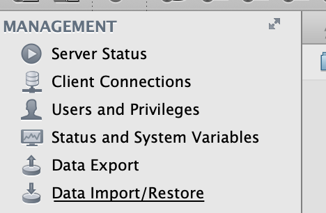
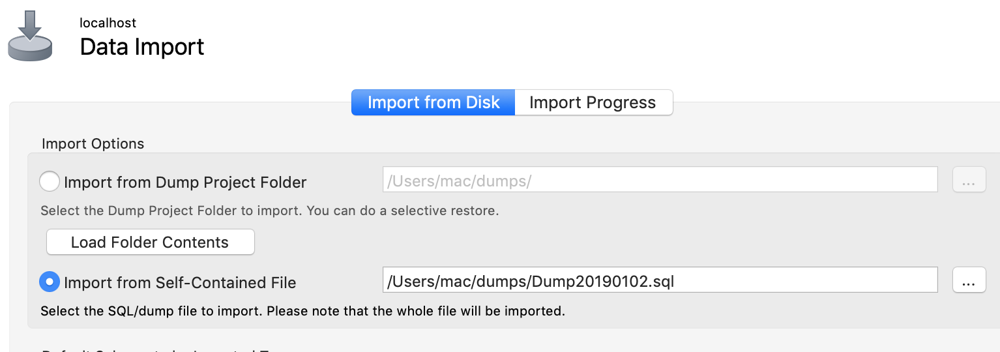
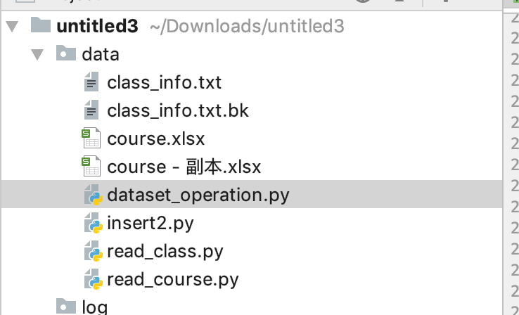
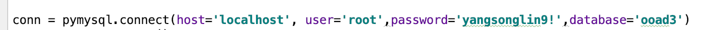
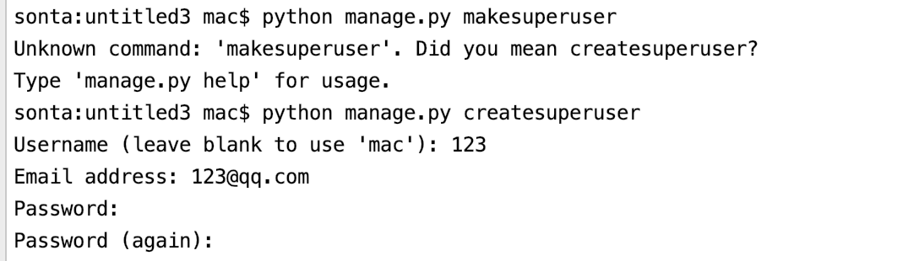
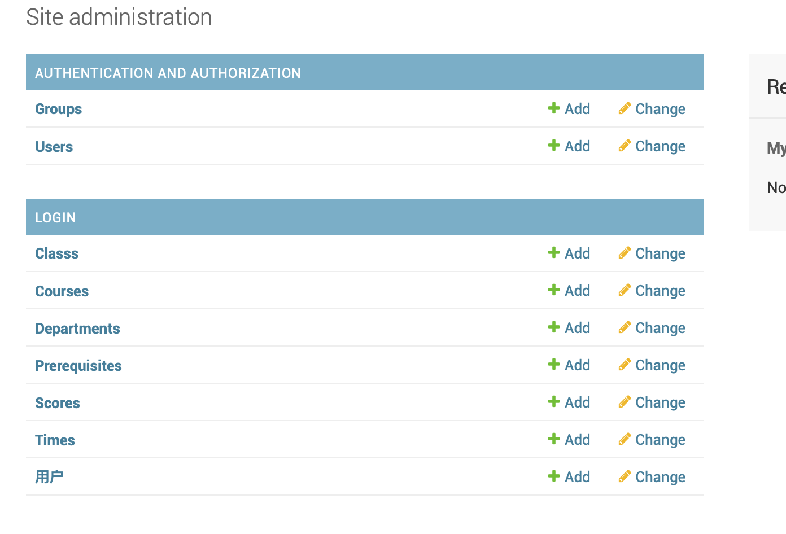
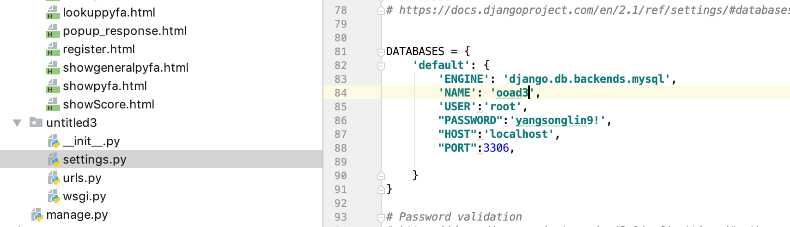

# Readme

### what environment do I need

pycharm,  mysql , mysql workbench,  django 2.1 

## how to import the database

in fact you have two choice:

1. By using mysql workbench. 

Data import/restore  

import from self-contained file  which contains in the root folder. 

2. python manage.py migrate  

   on the command line, then run the selected python file.  

   Keep your configuration right ! 

   

## Admin model 

Create a super user this way, then enter http://127.0.0.1:8000/admin/, a easy way for u to manage the database and see the model structure.  You can dive into it to add some data manually.  USE IT TO CREATE AN STUDENT ACCOUNT, we have no register page available for others but super user. 

## Anything I need to change?	

change to your own USER & PASSWORD

## Structure

all html file in  ./templates

all js/css  file in ./static

all model information in ./login/models.py

all logic code in ./login/views.py